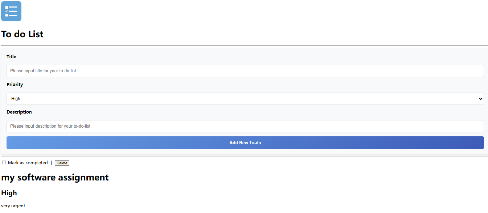

# **Todolist App**

## **Overview**
This is a simple **Progressive Web App (PWA)** that uses **IndexedDB** to manage a to-do list. It allows users to:
- Add new tasks with a **Title, Priority, and Description**
- View all saved tasks on the page
- Delete tasks when needed
- Work offline with **service worker** support for caching

### **App Screenshot**


## **Getting Started**

### **1. Install Dependencies**
Run the following command to install required packages:
```sh
npm install
```

### **2. Start the Application**
Launch the app with:
```sh
npm run start
```

## **About the Author**
**Max** | Student ID: **A00476491**
